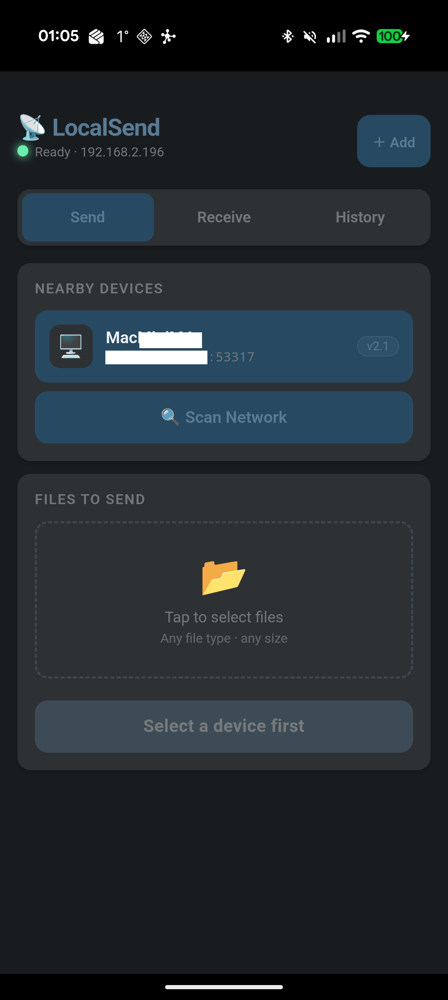

# LocalSend

A file sharing app that discovers nearby devices on the local network and transfers files directly between them. Compatible with the LocalSend protocol.

**Bridges used:** httpServer, httpClient, nsd, udp, storage, device, notification, vibration
