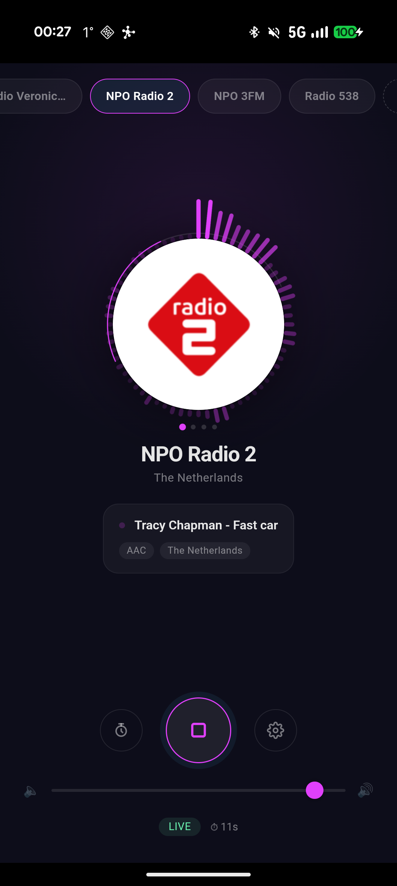

# Radio Player

A sleek internet radio player with live station logos, podcasts, audio visualizer, and stream metadata. Switch between stations with one tap.

**Bridges used:** audio, storage, httpClient, sensor, notification, vibration, alarm
